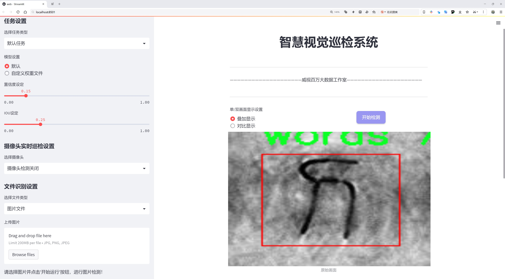
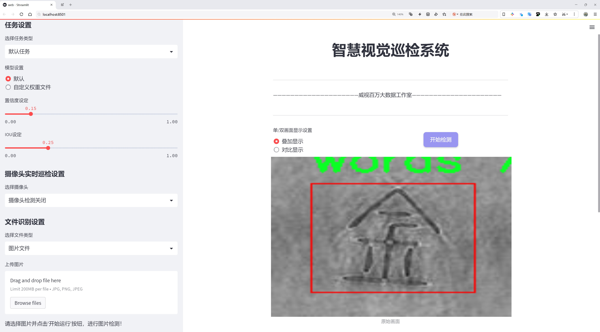
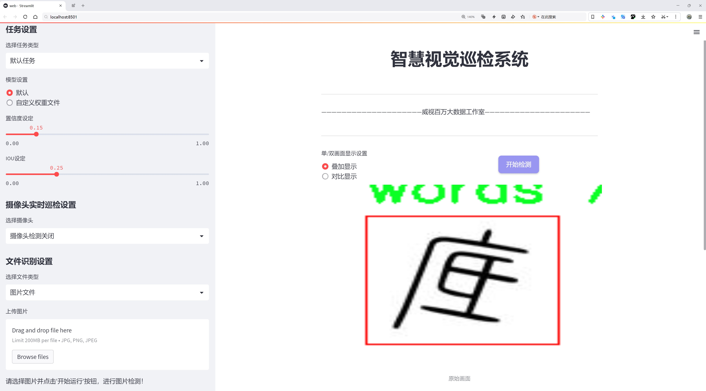
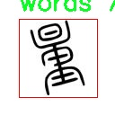
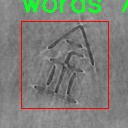
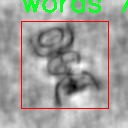
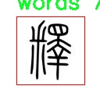
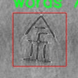

# 古文字定位检测系统源码分享
 # [一条龙教学YOLOV8标注好的数据集一键训练_70+全套改进创新点发刊_Web前端展示]

### 1.研究背景与意义

项目参考[AAAI Association for the Advancement of Artificial Intelligence](https://gitee.com/qunshansj/projects)

项目来源[AACV Association for the Advancement of Computer Vision](https://gitee.com/qunmasj/projects)

研究背景与意义

古文字的研究不仅是对历史文化的探索，更是对人类文明发展的重要见证。随着数字化技术的迅猛发展，古文字的保护与研究逐渐向智能化、自动化方向迈进。尤其是在古文字的定位与识别领域，深度学习技术的应用为传统的手工识别方法提供了全新的解决方案。YOLO（You Only Look Once）系列模型以其高效的实时目标检测能力，成为了计算机视觉领域的重要工具。YOLOv8作为该系列的最新版本，凭借其改进的网络结构和算法，展现出了更高的检测精度和速度，为古文字的自动识别与定位提供了有力的技术支持。

在古文字的研究中，汉字的演变与发展尤为重要。篆书作为汉字的一种古老书写形式，承载着丰富的历史信息和文化内涵。通过对篆书的数字化处理与分析，研究者能够更好地理解古代社会的文化、经济和政治等多方面的内容。然而，传统的古文字识别方法多依赖于人工识别，效率低下且容易受到主观因素的影响。因此，基于改进YOLOv8的古文字定位系统应运而生，旨在通过深度学习技术实现对古文字的高效、准确定位与识别。

本研究所使用的数据集包含9700幅篆书图像，涵盖了丰富的古文字样本。这一数据集不仅为模型的训练提供了充足的样本支持，也为后续的验证与测试奠定了基础。数据集中仅包含一个类别，即“文字”，这使得模型的训练更加专注于古文字的特征提取与识别。通过对这些图像的深入分析，研究者能够提取出篆书的独特特征，从而提高模型的识别准确率。此外，数据集的规模也为模型的泛化能力提供了保障，使其能够在不同的应用场景中表现出色。

基于改进YOLOv8的古文字定位系统，不仅具有重要的学术价值，还有着广泛的应用前景。首先，该系统可以为古文字的数字化保护提供技术支持，帮助文物保护机构更好地管理和维护古籍文献。其次，随着古文字识别技术的不断成熟，相关的文化产业也将迎来新的发展机遇，例如古文字的数字化出版、在线教育等。此外，该系统的成功应用还将推动计算机视觉技术在其他领域的拓展，如艺术品鉴定、历史文献分析等。

综上所述，基于改进YOLOv8的古文字定位系统不仅是对古文字研究方法的一次创新尝试，更是对传统文化保护与传承的一次积极探索。通过将现代科技与古老文化相结合，我们有望在古文字的研究与应用中开辟出一条全新的道路，为后人留下更加丰富的文化遗产。

### 2.图片演示







##### 注意：由于此博客编辑较早，上面“2.图片演示”和“3.视频演示”展示的系统图片或者视频可能为老版本，新版本在老版本的基础上升级如下：（实际效果以升级的新版本为准）

  （1）适配了YOLOV8的“目标检测”模型和“实例分割”模型，通过加载相应的权重（.pt）文件即可自适应加载模型。

  （2）支持“图片识别”、“视频识别”、“摄像头实时识别”三种识别模式。

  （3）支持“图片识别”、“视频识别”、“摄像头实时识别”三种识别结果保存导出，解决手动导出（容易卡顿出现爆内存）存在的问题，识别完自动保存结果并导出到tempDir中。

  （4）支持Web前端系统中的标题、背景图等自定义修改，后面提供修改教程。

  另外本项目提供训练的数据集和训练教程,暂不提供权重文件（best.pt）,需要您按照教程进行训练后实现图片演示和Web前端界面演示的效果。

### 3.视频演示

[3.1 视频演示](https://www.bilibili.com/video/BV1zo4berEuy/)

### 4.数据集信息展示

##### 4.1 本项目数据集详细数据（类别数＆类别名）

nc: 1
names: ['words']


##### 4.2 本项目数据集信息介绍

数据集信息展示

在本研究中，我们采用了名为“Chinese Seal Script”的数据集，以支持对古文字定位系统的训练，特别是针对YOLOv8模型的改进。该数据集专注于古代印章文字的识别与定位，旨在为古文字的数字化和自动化处理提供强有力的支持。古文字作为中华文化的重要组成部分，其复杂的形态和丰富的历史背景使得自动识别与定位成为一项具有挑战性的任务。

“Chinese Seal Script”数据集的设计充分考虑了古文字的特性，包含了多种印章文字的样本。这些样本经过精心挑选和标注，确保了数据的多样性和代表性。数据集中目前的类别数量为1，具体类别为“words”，这意味着所有样本均属于古文字的识别范畴。尽管类别数量相对较少，但每个样本都蕴含着丰富的文化信息和历史价值，能够为模型的训练提供足够的学习材料。

在数据集的构建过程中，研究团队注重样本的质量与多样性，确保涵盖了不同风格、不同年代的印章文字。这种多样性不仅有助于提升模型的泛化能力，还能使其在实际应用中更具鲁棒性。数据集中的每个样本都经过专业人员的标注，确保了其在训练过程中的准确性和有效性。通过这种方式，我们希望能够使YOLOv8模型在古文字的定位任务中表现出色。

此外，数据集的使用也考虑到了实际应用场景中的挑战，例如不同光照条件、背景杂乱程度等因素对古文字识别的影响。为此，数据集中包含了在各种环境下拍摄的印章文字图像，旨在模拟真实世界中的应用情况。这种策略不仅增强了模型的适应性，还提高了其在复杂环境下的识别能力。

在训练过程中，我们将“Chinese Seal Script”数据集与YOLOv8模型相结合，利用其强大的特征提取能力和实时检测性能，力求在古文字定位任务中取得突破。通过不断的迭代与优化，我们希望能够提升模型的准确性和效率，使其在古文字的自动识别和数字化过程中发挥更大的作用。

总之，“Chinese Seal Script”数据集为本研究提供了坚实的基础，支持我们在古文字定位系统的开发与改进中不断探索。通过对该数据集的深入分析与应用，我们期待能够推动古文字研究的数字化进程，助力中华文化的传承与发扬。











### 5.全套项目环境部署视频教程（零基础手把手教学）

[5.1 环境部署教程链接（零基础手把手教学）](https://www.ixigua.com/7404473917358506534?logTag=c807d0cbc21c0ef59de5)


[5.2 安装Python虚拟环境创建和依赖库安装视频教程链接（零基础手把手教学）](https://www.ixigua.com/7404474678003106304?logTag=1f1041108cd1f708b01a)

### 6.手把手YOLOV8训练视频教程（零基础小白有手就能学会）

[6.1 手把手YOLOV8训练视频教程（零基础小白有手就能学会）](https://www.ixigua.com/7404477157818401292?logTag=d31a2dfd1983c9668658)

### 7.70+种全套YOLOV8创新点代码加载调参视频教程（一键加载写好的改进模型的配置文件）

[7.1 70+种全套YOLOV8创新点代码加载调参视频教程（一键加载写好的改进模型的配置文件）](https://www.ixigua.com/7404478314661806627?logTag=29066f8288e3f4eea3a4)

### 8.70+种全套YOLOV8创新点原理讲解（非科班也可以轻松写刊发刊，V10版本正在科研待更新）

由于篇幅限制，每个创新点的具体原理讲解就不一一展开，具体见下列网址中的创新点对应子项目的技术原理博客网址【Blog】：


[8.1 70+种全套YOLOV8创新点原理讲解链接](https://gitee.com/qunmasj/good)

### 9.系统功能展示（检测对象为举例，实际内容以本项目数据集为准）

图9.1.系统支持检测结果表格显示

  图9.2.系统支持置信度和IOU阈值手动调节

  图9.3.系统支持自定义加载权重文件best.pt(需要你通过步骤5中训练获得)

  图9.4.系统支持摄像头实时识别

  图9.5.系统支持图片识别

  图9.6.系统支持视频识别

  图9.7.系统支持识别结果文件自动保存

  图9.8.系统支持Excel导出检测结果数据


### 10.原始YOLOV8算法原理

原始YOLOv8算法原理

YOLOv8作为YOLO系列的最新版本，继承并发展了前几代模型的核心思想，旨在实现更高效的目标检测。该算法的设计理念围绕着快速、准确和灵活的目标检测需求展开，充分利用了深度学习的最新进展。YOLOv8的网络结构主要由Backbone、Neck和Head三部分组成，每一部分都经过精心设计，以优化特征提取和目标检测的性能。

在Backbone部分，YOLOv8采用了CSPDarknet（Cross Stage Partial Darknet）结构，这一设计理念旨在通过将网络分为两个部分来提高特征提取的效率。每个部分都包含多个残差块，这种结构不仅增强了模型的表达能力，还在一定程度上缓解了深层网络中的梯度消失问题。与前代模型YOLOv5相比，YOLOv8引入了C2f模块替代了C3模块。C2f模块的设计独特之处在于其将输入特征图分为两个分支，每个分支通过卷积层进行降维处理，同时C2f模块还引入了v8_C2fBottleneck层，这些层的输出也被视为一个分支。通过这种方式，YOLOv8能够生成更高维度的特征图，并通过卷积层进行融合，从而获得更丰富的梯度流信息，提升了特征提取的能力。

YOLOv8还采用了快速空间金字塔池化（SPPF）结构，以有效提取不同尺度的特征。这一特征金字塔网络的设计使得模型在保持较低参数量和计算量的同时，显著提高了特征提取的效率。通过对多尺度特征的有效融合，YOLOv8能够更好地适应不同大小目标的检测需求。

在Neck部分，YOLOv8采用了特征金字塔网络（FPN）与路径聚合网络（PAN）的结合，形成了PAN-FPN结构。这一结构通过多个卷积层和池化层对特征图进行处理和压缩，进一步提升了特征融合的能力。通过自下而上的高层特征与中层、浅层特征的融合，YOLOv8能够有效地捕捉到目标的细节信息和语义信息，为后续的目标检测提供了更加全面的特征支持。

YOLOv8的Head部分则采用了解耦头结构，直接预测目标的中心点和宽高比例，摒弃了传统的Anchor框设计。这种Anchor-Free的检测方式不仅减少了Anchor框的数量，还提高了检测速度和准确度。YOLOv8的Head部分借鉴了YOLOX和YOLOv6的设计理念，采用了分类和回归的解耦策略，通过对输出特征图的处理，最终生成目标的边界框和类别信息。

在损失函数的设计上，YOLOv8引入了VFLLoss作为分类损失，同时结合DFLLoss和CIoULoss来优化回归损失。这种损失函数的组合旨在提升模型在样本不平衡情况下的学习能力，尤其是在处理小目标时，能够有效提高检测精度。

为了增强模型的训练效果，YOLOv8在数据预处理阶段采用了多种增强手段，包括马赛克增强、混合增强、空间扰动和颜色扰动等。这些增强策略能够丰富训练样本，提高模型的泛化能力，从而在实际应用中表现出更强的鲁棒性。

综上所述，YOLOv8通过一系列创新的设计和改进，显著提升了目标检测的性能。其高效的特征提取机制、灵活的目标检测方式以及精心设计的损失函数，使得YOLOv8在各种应用场景中都能展现出优异的检测能力。随着YOLOv8的发布，目标检测领域将迎来新的发展机遇，为实际应用提供了更为强大的技术支持。


### 11.项目核心源码讲解（再也不用担心看不懂代码逻辑）

#### 11.1 70+种YOLOv8算法改进源码大全和调试加载训练教程（非必要）\ultralytics\models\sam\build.py

以下是经过简化和注释的核心代码部分，主要功能是构建不同大小的Segment Anything Model (SAM)模型。代码中保留了模型构建的核心逻辑和相关参数配置。

```python
# 导入必要的库
from functools import partial
import torch
from ultralytics.utils.downloads import attempt_download_asset
from .modules.decoders import MaskDecoder
from .modules.encoders import ImageEncoderViT, PromptEncoder
from .modules.sam import Sam
from .modules.tiny_encoder import TinyViT
from .modules.transformer import TwoWayTransformer

def build_sam_vit_h(checkpoint=None):
    """构建并返回一个高尺寸的Segment Anything Model (SAM)。"""
    return _build_sam(
        encoder_embed_dim=1280,  # 嵌入维度
        encoder_depth=32,         # 编码器深度
        encoder_num_heads=16,     # 编码器头数
        encoder_global_attn_indexes=[7, 15, 23, 31],  # 全局注意力索引
        checkpoint=checkpoint,     # 可选的检查点路径
    )

def _build_sam(encoder_embed_dim, encoder_depth, encoder_num_heads, encoder_global_attn_indexes, checkpoint=None, mobile_sam=False):
    """构建选定的SAM模型架构。"""
    prompt_embed_dim = 256  # 提示嵌入维度
    image_size = 1024       # 输入图像大小
    vit_patch_size = 16     # ViT的补丁大小
    image_embedding_size = image_size // vit_patch_size  # 图像嵌入大小

    # 根据是否为移动SAM选择不同的图像编码器
    image_encoder = (TinyViT(
        img_size=1024,
        in_chans=3,
        num_classes=1000,
        embed_dims=encoder_embed_dim,
        depths=encoder_depth,
        num_heads=encoder_num_heads,
        window_sizes=[7, 7, 14, 7],
        mlp_ratio=4.0,
        drop_rate=0.0,
        drop_path_rate=0.0,
        use_checkpoint=False,
        mbconv_expand_ratio=4.0,
        local_conv_size=3,
        layer_lr_decay=0.8,
    ) if mobile_sam else ImageEncoderViT(
        depth=encoder_depth,
        embed_dim=encoder_embed_dim,
        img_size=image_size,
        mlp_ratio=4,
        norm_layer=partial(torch.nn.LayerNorm, eps=1e-6),
        num_heads=encoder_num_heads,
        patch_size=vit_patch_size,
        qkv_bias=True,
        use_rel_pos=True,
        global_attn_indexes=encoder_global_attn_indexes,
        window_size=14,
        out_chans=prompt_embed_dim,
    ))

    # 创建SAM模型
    sam = Sam(
        image_encoder=image_encoder,
        prompt_encoder=PromptEncoder(
            embed_dim=prompt_embed_dim,
            image_embedding_size=(image_embedding_size, image_embedding_size),
            input_image_size=(image_size, image_size),
            mask_in_chans=16,
        ),
        mask_decoder=MaskDecoder(
            num_multimask_outputs=3,
            transformer=TwoWayTransformer(
                depth=2,
                embedding_dim=prompt_embed_dim,
                mlp_dim=2048,
                num_heads=8,
            ),
            transformer_dim=prompt_embed_dim,
            iou_head_depth=3,
            iou_head_hidden_dim=256,
        ),
        pixel_mean=[123.675, 116.28, 103.53],  # 像素均值
        pixel_std=[58.395, 57.12, 57.375],      # 像素标准差
    )

    # 如果提供了检查点，则加载模型权重
    if checkpoint is not None:
        checkpoint = attempt_download_asset(checkpoint)  # 尝试下载检查点
        with open(checkpoint, 'rb') as f:
            state_dict = torch.load(f)  # 加载权重
        sam.load_state_dict(state_dict)  # 将权重加载到模型中

    sam.eval()  # 设置模型为评估模式
    return sam  # 返回构建的模型

# 定义不同模型的构建映射
sam_model_map = {
    'sam_h.pt': build_sam_vit_h,
    # 其他模型构建函数...
}

def build_sam(ckpt='sam_b.pt'):
    """根据指定的检查点构建SAM模型。"""
    model_builder = None
    ckpt = str(ckpt)  # 转换为字符串以支持Path类型
    for k in sam_model_map.keys():
        if ckpt.endswith(k):
            model_builder = sam_model_map.get(k)  # 获取对应的模型构建函数

    if not model_builder:
        raise FileNotFoundError(f'{ckpt} 不是支持的SAM模型。可用模型有: \n {sam_model_map.keys()}')

    return model_builder(ckpt)  # 返回构建的模型
```

### 代码分析
1. **模型构建函数**：`build_sam_vit_h`、`_build_sam`等函数负责根据不同的参数构建SAM模型，支持不同的尺寸和配置。
2. **图像编码器选择**：根据是否为移动版本选择不同的图像编码器（`TinyViT`或`ImageEncoderViT`）。
3. **模型权重加载**：支持从检查点加载预训练模型的权重，以便进行推理或微调。
4. **模型评估模式**：构建完成后，将模型设置为评估模式，以便进行推理。

这个文件是一个用于构建和加载Segment Anything Model（SAM）模型的Python脚本，主要用于图像分割任务。代码中定义了多个函数来构建不同尺寸的SAM模型，包括高（h）、大（l）、小（b）和移动版（Mobile-SAM）。每个模型的构建过程都通过调用一个私有函数`_build_sam`来实现，该函数根据传入的参数配置模型的各个组件。

在构建模型时，首先定义了一些超参数，如编码器的嵌入维度、深度、头数以及全局注意力索引等。这些参数会影响模型的性能和计算复杂度。然后，根据是否是移动版模型，选择不同的图像编码器。移动版使用的是TinyViT，而其他版本则使用ImageEncoderViT。图像编码器的构建过程中，涉及到图像大小、类别数、嵌入维度等多个参数的设置。

在SAM模型的构建中，还包括了一个提示编码器（PromptEncoder）和一个掩码解码器（MaskDecoder）。提示编码器负责处理输入的提示信息，而掩码解码器则用于生成最终的分割掩码。掩码解码器内部使用了一个双向变换器（TwoWayTransformer），这是一个深度学习模块，用于增强模型的特征提取能力。

如果提供了检查点（checkpoint），模型会尝试下载并加载预训练的权重。通过`torch.load`函数加载权重后，调用`load_state_dict`方法将权重应用到模型中，并将模型设置为评估模式（eval），以便进行推理。

最后，文件中定义了一个字典`samm_model_map`，用于将模型名称映射到相应的构建函数。`build_sam`函数根据传入的检查点名称，查找并调用相应的构建函数来创建模型。如果传入的检查点不在支持的模型列表中，会抛出一个文件未找到的异常。

整体来看，这个文件的功能是提供一个灵活的接口来构建和加载不同版本的SAM模型，便于在图像分割任务中使用。

#### 11.2 ui.py

以下是代码中最核心的部分，并附上详细的中文注释：

```python
import sys
import subprocess

def run_script(script_path):
    """
    使用当前 Python 环境运行指定的脚本。

    Args:
        script_path (str): 要运行的脚本路径

    Returns:
        None
    """
    # 获取当前 Python 解释器的路径
    python_path = sys.executable

    # 构建运行命令，使用 streamlit 运行指定的脚本
    command = f'"{python_path}" -m streamlit run "{script_path}"'

    # 执行命令，shell=True 允许使用 shell 命令
    result = subprocess.run(command, shell=True)
    
    # 检查命令执行的返回码，如果不为 0，表示出错
    if result.returncode != 0:
        print("脚本运行出错。")

# 主程序入口
if __name__ == "__main__":
    # 指定要运行的脚本路径
    script_path = "web.py"  # 这里可以替换为实际的脚本路径

    # 调用函数运行指定的脚本
    run_script(script_path)
```

### 代码说明：
1. **导入模块**：
   - `sys`：用于访问与 Python 解释器紧密相关的变量和函数。
   - `subprocess`：用于执行外部命令和程序。

2. **`run_script` 函数**：
   - 该函数接受一个脚本路径作为参数，并使用当前 Python 环境运行该脚本。
   - `sys.executable` 获取当前 Python 解释器的路径。
   - 使用 `subprocess.run` 执行构建的命令，`shell=True` 允许在 shell 中执行命令。
   - 检查命令的返回码，如果返回码不为 0，表示脚本运行出错。

3. **主程序入口**：
   - 通过 `if __name__ == "__main__":` 确保该代码块仅在直接运行脚本时执行。
   - 指定要运行的脚本路径，并调用 `run_script` 函数执行该脚本。

这个程序文件名为 `ui.py`，其主要功能是通过当前的 Python 环境运行一个指定的脚本，具体是使用 Streamlit 来启动一个 Web 应用。

首先，程序导入了几个必要的模块，包括 `sys`、`os` 和 `subprocess`。其中，`sys` 模块用于访问与 Python 解释器相关的变量和函数，`os` 模块提供了与操作系统交互的功能，而 `subprocess` 模块则用于创建新进程、连接到它们的输入/输出/错误管道，并获取它们的返回码。

接下来，程序从 `QtFusion.path` 模块中导入了 `abs_path` 函数，这个函数的作用是获取给定路径的绝对路径。

在 `run_script` 函数中，程序接受一个参数 `script_path`，这个参数是要运行的脚本的路径。函数首先获取当前 Python 解释器的路径，接着构建一个命令字符串，该命令使用 Streamlit 来运行指定的脚本。命令的格式是 `"{python_path}" -m streamlit run "{script_path}"`，其中 `python_path` 是当前 Python 解释器的路径，`script_path` 是传入的脚本路径。

然后，程序使用 `subprocess.run` 方法执行这个命令，并通过 `shell=True` 参数在一个新的 shell 中运行它。执行后，程序检查返回码，如果返回码不为 0，表示脚本运行出错，程序会打印出相应的错误信息。

在文件的最后部分，程序通过 `if __name__ == "__main__":` 判断当前模块是否是主程序，如果是，则指定要运行的脚本路径为 `web.py` 的绝对路径，并调用 `run_script` 函数来执行这个脚本。

总的来说，这个程序的主要目的是为用户提供一个简单的接口，以便在当前 Python 环境中启动一个基于 Streamlit 的 Web 应用。

#### 11.3 70+种YOLOv8算法改进源码大全和调试加载训练教程（非必要）\ultralytics\nn\extra_modules\rep_block.py

以下是代码中最核心的部分，并附上详细的中文注释：

```python
import torch
import torch.nn as nn
import torch.nn.functional as F

# 定义一个模块，主要用于实现多分支卷积块
class DiverseBranchBlock(nn.Module):
    def __init__(self, in_channels, out_channels, kernel_size,
                 stride=1, padding=None, dilation=1, groups=1,
                 internal_channels_1x1_3x3=None,
                 deploy=False, single_init=False):
        super(DiverseBranchBlock, self).__init__()
        self.deploy = deploy  # 是否为部署模式

        self.nonlinear = Conv.default_act  # 非线性激活函数
        self.kernel_size = kernel_size  # 卷积核大小
        self.out_channels = out_channels  # 输出通道数
        self.groups = groups  # 分组卷积的组数
        
        # 计算填充，如果未指定则自动计算
        if padding is None:
            padding = autopad(kernel_size, padding, dilation)
        assert padding == kernel_size // 2  # 确保填充正确

        # 如果是部署模式，使用一个卷积层进行重参数化
        if deploy:
            self.dbb_reparam = nn.Conv2d(in_channels=in_channels, out_channels=out_channels, kernel_size=kernel_size, stride=stride,
                                      padding=padding, dilation=dilation, groups=groups, bias=True)
        else:
            # 定义原始卷积和批归一化层
            self.dbb_origin = conv_bn(in_channels=in_channels, out_channels=out_channels, kernel_size=kernel_size, stride=stride, padding=padding, dilation=dilation, groups=groups)

            # 定义平均池化分支
            self.dbb_avg = nn.Sequential()
            if groups < out_channels:
                self.dbb_avg.add_module('conv',
                                        nn.Conv2d(in_channels=in_channels, out_channels=out_channels, kernel_size=1,
                                                  stride=1, padding=0, groups=groups, bias=False))
                self.dbb_avg.add_module('bn', BNAndPadLayer(pad_pixels=padding, num_features=out_channels))
                self.dbb_avg.add_module('avg', nn.AvgPool2d(kernel_size=kernel_size, stride=stride, padding=0))
                self.dbb_1x1 = conv_bn(in_channels=in_channels, out_channels=out_channels, kernel_size=1, stride=stride,
                                       padding=0, groups=groups)
            else:
                self.dbb_avg.add_module('avg', nn.AvgPool2d(kernel_size=kernel_size, stride=stride, padding=padding))

            self.dbb_avg.add_module('avgbn', nn.BatchNorm2d(out_channels))  # 添加批归一化层

            # 定义1x1和kxk卷积的组合
            if internal_channels_1x1_3x3 is None:
                internal_channels_1x1_3x3 = in_channels if groups < out_channels else 2 * in_channels

            self.dbb_1x1_kxk = nn.Sequential()
            if internal_channels_1x1_3x3 == in_channels:
                self.dbb_1x1_kxk.add_module('idconv1', IdentityBasedConv1x1(channels=in_channels, groups=groups))
            else:
                self.dbb_1x1_kxk.add_module('conv1', nn.Conv2d(in_channels=in_channels, out_channels=internal_channels_1x1_3x3,
                                                            kernel_size=1, stride=1, padding=0, groups=groups, bias=False))
            self.dbb_1x1_kxk.add_module('bn1', BNAndPadLayer(pad_pixels=padding, num_features=internal_channels_1x1_3x3, affine=True))
            self.dbb_1x1_kxk.add_module('conv2', nn.Conv2d(in_channels=internal_channels_1x1_3x3, out_channels=out_channels,
                                                            kernel_size=kernel_size, stride=stride, padding=0, groups=groups, bias=False))
            self.dbb_1x1_kxk.add_module('bn2', nn.BatchNorm2d(out_channels))

    def forward(self, inputs):
        # 前向传播
        if hasattr(self, 'dbb_reparam'):
            return self.nonlinear(self.dbb_reparam(inputs))  # 如果是部署模式，直接使用重参数化的卷积

        out = self.dbb_origin(inputs)  # 原始卷积输出
        if hasattr(self, 'dbb_1x1'):
            out += self.dbb_1x1(inputs)  # 加上1x1卷积的输出
        out += self.dbb_avg(inputs)  # 加上平均池化的输出
        out += self.dbb_1x1_kxk(inputs)  # 加上kxk卷积的输出
        return self.nonlinear(out)  # 返回经过非线性激活后的输出

    def switch_to_deploy(self):
        # 切换到部署模式
        if hasattr(self, 'dbb_reparam'):
            return
        kernel, bias = self.get_equivalent_kernel_bias()  # 获取等效的卷积核和偏置
        self.dbb_reparam = nn.Conv2d(in_channels=self.dbb_origin.conv.in_channels, out_channels=self.dbb_origin.conv.out_channels,
                                     kernel_size=self.dbb_origin.conv.kernel_size, stride=self.dbb_origin.conv.stride,
                                     padding=self.dbb_origin.conv.padding, dilation=self.dbb_origin.conv.dilation, groups=self.dbb_origin.conv.groups, bias=True)
        self.dbb_reparam.weight.data = kernel  # 设置卷积核
        self.dbb_reparam.bias.data = bias  # 设置偏置
        for para in self.parameters():
            para.detach_()  # 分离参数
        self.__delattr__('dbb_origin')  # 删除原始卷积模块
        self.__delattr__('dbb_avg')  # 删除平均池化模块
        if hasattr(self, 'dbb_1x1'):
            self.__delattr__('dbb_1x1')  # 删除1x1卷积模块
        self.__delattr__('dbb_1x1_kxk')  # 删除kxk卷积模块
```

### 代码说明
1. **DiverseBranchBlock 类**：实现了一个多分支卷积块，包含多个分支（如原始卷积、平均池化、1x1卷积等），用于提取特征。
2. **构造函数 `__init__`**：初始化卷积层、批归一化层及其组合，支持不同的输入输出通道、卷积核大小等参数。
3. **前向传播 `forward`**：根据是否在部署模式下，选择使用重参数化的卷积或多个分支的输出进行计算。
4. **切换到部署模式 `switch_to_deploy`**：将模型切换到部署模式，使用合并后的卷积核和偏置，删除不必要的模块以减少计算量。

通过这些核心部分，DiverseBranchBlock 实现了高效的特征提取，同时支持在训练和推理阶段的灵活切换。

这个程序文件是YOLOv8算法中一个重要的模块，主要实现了一个名为`DiverseBranchBlock`的神经网络层。该层的设计目的是为了在卷积神经网络中提供多样化的分支结构，以增强模型的表达能力和性能。

首先，文件中导入了必要的库，包括`torch`和`torch.nn`，以及一些自定义的卷积模块。接着，定义了一些辅助函数，这些函数用于处理卷积核和偏置的转换，主要包括对批归一化（Batch Normalization）层的融合、分支的合并等操作。

在`DiverseBranchBlock`类的构造函数中，首先设置了一些基本参数，比如输入和输出通道数、卷积核大小、步幅、填充、扩张率和分组数等。根据这些参数，模块会初始化不同的卷积层和批归一化层。如果设置为部署模式（`deploy=True`），则会创建一个重参数化的卷积层；否则，会创建多个分支的卷积层。

具体来说，该模块包含多个分支：
1. `dbb_origin`：基础的卷积和批归一化组合。
2. `dbb_avg`：平均池化和批归一化的组合，提供了另一种特征提取方式。
3. `dbb_1x1`：1x1卷积层，用于改变通道数。
4. `dbb_1x1_kxk`：1x1卷积和k x k卷积的组合，进一步增强特征提取能力。

在前向传播（`forward`）过程中，模块会根据当前的状态（是否在部署模式）选择不同的计算路径。如果处于部署模式，则直接使用重参数化的卷积层；否则，会将各个分支的输出相加，并通过非线性激活函数进行处理。

此外，模块还提供了一些初始化方法，例如`init_gamma`和`single_init`，用于设置批归一化层的权重，以便在训练过程中更好地控制模型的学习。

总体来说，这个模块通过多分支结构和灵活的卷积操作，旨在提高YOLOv8模型在目标检测任务中的性能，适应不同的输入特征和网络结构需求。

#### 11.4 70+种YOLOv8算法改进源码大全和调试加载训练教程（非必要）\ultralytics\trackers\utils\matching.py

以下是代码中最核心的部分，并附上详细的中文注释：

```python
import numpy as np
import scipy
from scipy.spatial.distance import cdist
from ultralytics.utils.metrics import bbox_ioa

try:
    import lap  # 导入线性分配库
    assert lap.__version__  # 确保导入的库不是目录
except (ImportError, AssertionError, AttributeError):
    from ultralytics.utils.checks import check_requirements
    check_requirements('lapx>=0.5.2')  # 检查并安装lap库
    import lap

def linear_assignment(cost_matrix, thresh, use_lap=True):
    """
    使用线性分配算法进行匹配。

    参数:
        cost_matrix (np.ndarray): 包含分配成本的矩阵。
        thresh (float): 认为分配有效的阈值。
        use_lap (bool, optional): 是否使用lap.lapjv算法。默认为True。

    返回:
        (tuple): 包含匹配索引、未匹配的索引（来自'a'）和未匹配的索引（来自'b'）的元组。
    """
    if cost_matrix.size == 0:
        return np.empty((0, 2), dtype=int), tuple(range(cost_matrix.shape[0])), tuple(range(cost_matrix.shape[1]))

    if use_lap:
        # 使用lap库进行线性分配
        _, x, y = lap.lapjv(cost_matrix, extend_cost=True, cost_limit=thresh)
        matches = [[ix, mx] for ix, mx in enumerate(x) if mx >= 0]  # 记录匹配的索引
        unmatched_a = np.where(x < 0)[0]  # 找到未匹配的'a'索引
        unmatched_b = np.where(y < 0)[0]  # 找到未匹配的'b'索引
    else:
        # 使用scipy进行线性分配
        x, y = scipy.optimize.linear_sum_assignment(cost_matrix)  # 行 x, 列 y
        matches = np.asarray([[x[i], y[i]] for i in range(len(x)) if cost_matrix[x[i], y[i]] <= thresh])
        if len(matches) == 0:
            unmatched_a = list(np.arange(cost_matrix.shape[0]))
            unmatched_b = list(np.arange(cost_matrix.shape[1]))
        else:
            unmatched_a = list(set(np.arange(cost_matrix.shape[0])) - set(matches[:, 0]))
            unmatched_b = list(set(np.arange(cost_matrix.shape[1])) - set(matches[:, 1]))

    return matches, unmatched_a, unmatched_b  # 返回匹配结果和未匹配索引

def iou_distance(atracks, btracks):
    """
    基于交并比（IoU）计算轨迹之间的成本。

    参数:
        atracks (list[STrack] | list[np.ndarray]): 轨迹'a'或边界框的列表。
        btracks (list[STrack] | list[np.ndarray]): 轨迹'b'或边界框的列表。

    返回:
        (np.ndarray): 基于IoU计算的成本矩阵。
    """
    if (len(atracks) > 0 and isinstance(atracks[0], np.ndarray)) \
            or (len(btracks) > 0 and isinstance(btracks[0], np.ndarray)):
        atlbrs = atracks  # 如果输入是边界框，直接赋值
        btlbrs = btracks
    else:
        atlbrs = [track.tlbr for track in atracks]  # 提取轨迹'a'的边界框
        btlbrs = [track.tlbr for track in btracks]  # 提取轨迹'b'的边界框

    ious = np.zeros((len(atlbrs), len(btlbrs)), dtype=np.float32)  # 初始化IoU矩阵
    if len(atlbrs) and len(btlbrs):
        # 计算IoU
        ious = bbox_ioa(np.ascontiguousarray(atlbrs, dtype=np.float32),
                        np.ascontiguousarray(btlbrs, dtype=np.float32),
                        iou=True)
    return 1 - ious  # 返回成本矩阵（1 - IoU）

def embedding_distance(tracks, detections, metric='cosine'):
    """
    基于嵌入计算轨迹和检测之间的距离。

    参数:
        tracks (list[STrack]): 轨迹列表。
        detections (list[BaseTrack]): 检测列表。
        metric (str, optional): 距离计算的度量。默认为'cosine'。

    返回:
        (np.ndarray): 基于嵌入计算的成本矩阵。
    """
    cost_matrix = np.zeros((len(tracks), len(detections)), dtype=np.float32)  # 初始化成本矩阵
    if cost_matrix.size == 0:
        return cost_matrix
    det_features = np.asarray([track.curr_feat for track in detections], dtype=np.float32)  # 获取检测特征
    track_features = np.asarray([track.smooth_feat for track in tracks], dtype=np.float32)  # 获取轨迹特征
    cost_matrix = np.maximum(0.0, cdist(track_features, det_features, metric))  # 计算距离并确保非负
    return cost_matrix  # 返回成本矩阵

def fuse_score(cost_matrix, detections):
    """
    将成本矩阵与检测分数融合以生成单一相似度矩阵。

    参数:
        cost_matrix (np.ndarray): 包含分配成本的矩阵。
        detections (list[BaseTrack]): 带有分数的检测列表。

    返回:
        (np.ndarray): 融合后的相似度矩阵。
    """
    if cost_matrix.size == 0:
        return cost_matrix
    iou_sim = 1 - cost_matrix  # 计算IoU相似度
    det_scores = np.array([det.score for det in detections])  # 获取检测分数
    det_scores = np.expand_dims(det_scores, axis=0).repeat(cost_matrix.shape[0], axis=0)  # 扩展分数以匹配成本矩阵
    fuse_sim = iou_sim * det_scores  # 融合相似度
    return 1 - fuse_sim  # 返回融合后的成本
```

### 代码核心部分说明：
1. **线性分配（linear_assignment）**：该函数使用成本矩阵和阈值进行匹配，返回匹配的索引和未匹配的索引。
2. **IoU距离（iou_distance）**：计算两个轨迹之间的交并比（IoU），并返回成本矩阵。
3. **嵌入距离（embedding_distance）**：计算轨迹和检测之间的距离，基于特征嵌入。
4. **融合分数（fuse_score）**：将成本矩阵与检测分数结合，生成一个相似度矩阵。

这个程序文件是用于YOLOv8算法中的目标跟踪模块，主要涉及匹配算法和距离计算的实现。文件中导入了必要的库，包括NumPy和SciPy，用于数值计算和线性分配算法的实现。

首先，文件尝试导入`lap`库，这是一个用于线性分配的库。如果导入失败，则会检查并安装`lapx`库，这是一个替代的线性分配库。接下来，定义了一个`linear_assignment`函数，该函数接受一个成本矩阵、阈值和一个可选参数来选择使用的线性分配方法。函数的主要功能是根据成本矩阵进行匹配，返回匹配的索引以及未匹配的索引。

接下来，定义了`iou_distance`函数，用于计算两个轨迹或边界框之间的交并比（IoU）距离。该函数首先检查输入是否为NumPy数组，如果不是，则提取轨迹的边界框。然后，使用`bbox_ioa`函数计算IoU值，并返回1减去IoU值作为成本矩阵。

然后是`embedding_distance`函数，它计算轨迹和检测之间的距离，基于特征嵌入。该函数创建一个成本矩阵，存储轨迹和检测之间的距离，使用余弦距离作为默认度量。通过计算轨迹的平滑特征和检测特征之间的距离，填充成本矩阵。

最后，定义了`fuse_score`函数，它将成本矩阵与检测得分融合，生成一个相似度矩阵。该函数首先计算IoU相似度，然后将检测得分扩展并与IoU相似度相乘，最终返回融合后的成本矩阵。

整体来看，这个文件实现了目标跟踪中的关键功能，包括匹配算法、距离计算和得分融合，为YOLOv8算法的目标跟踪提供了重要的支持。

#### 11.5 70+种YOLOv8算法改进源码大全和调试加载训练教程（非必要）\ultralytics\nn\extra_modules\kernel_warehouse.py

以下是代码中最核心的部分，并附上详细的中文注释：

```python
import torch
import torch.nn as nn
import torch.nn.functional as F

class Attention(nn.Module):
    def __init__(self, in_planes, reduction, num_static_cell, num_local_mixture, norm_layer=nn.BatchNorm1d,
                 cell_num_ratio=1.0, nonlocal_basis_ratio=1.0, start_cell_idx=None):
        super(Attention, self).__init__()
        # 计算隐藏层的通道数
        hidden_planes = max(int(in_planes * reduction), 16)
        self.kw_planes_per_mixture = num_static_cell + 1  # 每个混合物的通道数
        self.num_local_mixture = num_local_mixture  # 本地混合物的数量
        self.kw_planes = self.kw_planes_per_mixture * num_local_mixture  # 总的通道数

        # 计算本地和非本地单元的数量
        self.num_local_cell = int(cell_num_ratio * num_local_mixture)
        self.num_nonlocal_cell = num_static_cell - self.num_local_cell
        self.start_cell_idx = start_cell_idx

        # 定义层
        self.avgpool = nn.AdaptiveAvgPool1d(1)  # 自适应平均池化
        self.fc1 = nn.Linear(in_planes, hidden_planes, bias=(norm_layer is not nn.BatchNorm1d))  # 全连接层
        self.norm1 = norm_layer(hidden_planes)  # 归一化层
        self.act1 = nn.ReLU(inplace=True)  # 激活函数

        # 定义映射到单元的层
        if nonlocal_basis_ratio >= 1.0:
            self.map_to_cell = nn.Identity()  # 直接映射
            self.fc2 = nn.Linear(hidden_planes, self.kw_planes, bias=True)  # 映射层
        else:
            self.map_to_cell = self.map_to_cell_basis  # 使用基础映射
            self.num_basis = max(int(self.num_nonlocal_cell * nonlocal_basis_ratio), 16)  # 基础单元数量
            self.fc2 = nn.Linear(hidden_planes, (self.num_local_cell + self.num_basis + 1) * num_local_mixture, bias=False)
            self.fc3 = nn.Linear(self.num_basis, self.num_nonlocal_cell, bias=False)  # 非本地单元映射层
            self.basis_bias = nn.Parameter(torch.zeros([self.kw_planes]), requires_grad=True).float()  # 基础偏置

        self.temp_bias = torch.zeros([self.kw_planes], requires_grad=False).float()  # 温度偏置
        self.temp_value = 0  # 温度值
        self._initialize_weights()  # 初始化权重

    def _initialize_weights(self):
        # 初始化网络中的权重
        for m in self.modules():
            if isinstance(m, nn.Linear):
                nn.init.kaiming_normal_(m.weight, mode='fan_out', nonlinearity='relu')  # Kaiming初始化
                if m.bias is not None:
                    nn.init.constant_(m.bias, 0)  # 偏置初始化为0
            if isinstance(m, nn.BatchNorm1d):
                nn.init.constant_(m.weight, 1)  # 批归一化权重初始化为1
                nn.init.constant_(m.bias, 0)  # 偏置初始化为0

    def forward(self, x):
        # 前向传播
        x = self.avgpool(x.reshape(*x.shape[:2], -1)).squeeze(dim=-1)  # 池化
        x = self.act1(self.norm1(self.fc1(x)))  # 线性变换 + 归一化 + 激活
        x = self.map_to_cell(self.fc2(x)).reshape(-1, self.kw_planes)  # 映射到单元
        x = x / (torch.sum(torch.abs(x), dim=1).view(-1, 1) + 1e-3)  # 归一化
        x = (1.0 - self.temp_value) * x.reshape(-1, self.kw_planes) \
            + self.temp_value * self.temp_bias.to(x.device).view(1, -1)  # 温度调整
        return x.reshape(-1, self.kw_planes_per_mixture)[:, :-1]  # 返回结果

class KWconvNd(nn.Module):
    def __init__(self, in_planes, out_planes, kernel_size, stride=1, padding=0, dilation=1, groups=1,
                 bias=False, warehouse_manager=None):
        super(KWconvNd, self).__init__()
        self.in_planes = in_planes  # 输入通道数
        self.out_planes = out_planes  # 输出通道数
        self.kernel_size = kernel_size  # 卷积核大小
        self.stride = stride  # 步幅
        self.padding = padding  # 填充
        self.dilation = dilation  # 膨胀
        self.groups = groups  # 分组卷积
        self.bias = nn.Parameter(torch.zeros([self.out_planes]), requires_grad=True).float() if bias else None  # 偏置
        self.warehouse_manager = warehouse_manager  # 仓库管理器

    def forward(self, x):
        # 前向传播
        kw_attention = self.attention(x).type(x.dtype)  # 获取注意力权重
        batch_size = x.shape[0]  # 批大小
        x = x.reshape(1, -1, *x.shape[2:])  # 变形
        weight = self.warehouse_manager.take_cell(self.warehouse_id).reshape(self.cell_shape[0], -1).type(x.dtype)  # 获取权重
        aggregate_weight = torch.mm(kw_attention, weight)  # 加权
        output = self.func_conv(x, weight=aggregate_weight, bias=None, stride=self.stride, padding=self.padding,
                                dilation=self.dilation, groups=self.groups * batch_size)  # 卷积操作
        output = output.view(batch_size, self.out_planes, *output.shape[2:])  # 变形
        if self.bias is not None:
            output = output + self.bias.reshape(1, -1, *([1]*self.dimension))  # 加上偏置
        return output  # 返回输出
```

### 代码核心部分解释：
1. **Attention类**：实现了一个注意力机制，能够根据输入的特征图计算出不同通道的权重。它通过全连接层、归一化层和激活函数进行特征变换，并在前向传播中应用温度调整来控制权重的平滑性。

2. **KWconvNd类**：这是一个通用的卷积层类，能够处理不同维度的卷积操作。它接收输入和输出通道数、卷积核大小、步幅、填充等参数，并在前向传播中使用注意力机制和仓库管理器来动态获取卷积权重。

3. **前向传播**：在`forward`方法中，首先计算注意力权重，然后根据这些权重从仓库中获取相应的卷积权重，最后执行卷积操作并返回结果。

这些核心部分共同构成了一个灵活且强大的卷积神经网络模块，能够动态调整卷积权重以适应不同的输入特征。

这个程序文件是YOLOv8算法中一个重要的模块，主要实现了一个名为“Kernel Warehouse”的机制，用于动态管理卷积层的权重。文件中包含多个类和函数，以下是对其主要内容的讲解。

首先，文件导入了必要的PyTorch库和一些工具函数。`parse`函数用于处理输入参数，确保它们是可迭代的，并根据需要扩展到指定的长度。

接下来，定义了一个`Attention`类，这个类实现了注意力机制。它的构造函数接收多个参数，包括输入通道数、缩减比例、静态单元数量、局部混合数量等。类中定义了多个层，如全连接层和归一化层，并在`forward`方法中实现了注意力计算的具体逻辑。

`KWconvNd`类是一个通用的卷积层类，支持不同维度的卷积操作。它的构造函数接收卷积的输入输出通道、卷积核大小、步幅、填充等参数，并根据这些参数初始化相应的卷积层。`init_attention`方法用于初始化注意力机制，而`forward`方法则实现了前向传播的计算过程。

接着，`KWConv1d`、`KWConv2d`和`KWConv3d`类分别继承自`KWconvNd`，实现了一维、二维和三维卷积的具体细节。

`KWLinear`类则是一个线性层的实现，内部使用了一维卷积来实现其功能。

`Warehouse_Manager`类是核心管理类，负责管理卷积层的权重。它的构造函数接收多个参数来配置仓库的行为，包括缩减比例、单元数量比例、共享范围等。`reserve`方法用于创建一个动态卷积层而不分配权重，并记录其信息。`store`方法则负责计算并存储卷积层的权重。

`KWConv`类是一个封装了卷积操作的类，结合了`Warehouse_Manager`来进行权重的管理和卷积操作的执行。

最后，`get_temperature`函数用于计算温度值，这在训练过程中用于动态调整模型的行为。

总体而言，这个文件实现了一个灵活的卷积层权重管理机制，通过注意力机制和动态仓库的方式，提升了YOLOv8算法的性能和可扩展性。

#### 11.6 train.py

以下是经过简化和注释的核心代码部分：

```python
import random
import numpy as np
import torch.nn as nn
from ultralytics.data import build_dataloader, build_yolo_dataset
from ultralytics.engine.trainer import BaseTrainer
from ultralytics.models import yolo
from ultralytics.nn.tasks import DetectionModel
from ultralytics.utils import LOGGER, RANK
from ultralytics.utils.torch_utils import de_parallel, torch_distributed_zero_first

class DetectionTrainer(BaseTrainer):
    """
    基于检测模型的训练类，继承自BaseTrainer类。
    """

    def build_dataset(self, img_path, mode="train", batch=None):
        """
        构建YOLO数据集。

        参数:
            img_path (str): 包含图像的文件夹路径。
            mode (str): 模式，可以是'train'或'val'，用户可以为每种模式自定义不同的增强。
            batch (int, optional): 批次大小，适用于'rect'模式。默认为None。
        """
        gs = max(int(de_parallel(self.model).stride.max() if self.model else 0), 32)  # 获取模型的最大步幅
        return build_yolo_dataset(self.args, img_path, batch, self.data, mode=mode, rect=mode == "val", stride=gs)

    def get_dataloader(self, dataset_path, batch_size=16, rank=0, mode="train"):
        """构造并返回数据加载器。"""
        assert mode in ["train", "val"]  # 确保模式有效
        with torch_distributed_zero_first(rank):  # 仅在DDP中初始化数据集.cache一次
            dataset = self.build_dataset(dataset_path, mode, batch_size)  # 构建数据集
        shuffle = mode == "train"  # 训练模式下打乱数据
        workers = self.args.workers if mode == "train" else self.args.workers * 2  # 设置工作线程数
        return build_dataloader(dataset, batch_size, workers, shuffle, rank)  # 返回数据加载器

    def preprocess_batch(self, batch):
        """对图像批次进行预处理，包括缩放和转换为浮点数。"""
        batch["img"] = batch["img"].to(self.device, non_blocking=True).float() / 255  # 转换为浮点数并归一化
        if self.args.multi_scale:  # 如果启用多尺度
            imgs = batch["img"]
            sz = (
                random.randrange(self.args.imgsz * 0.5, self.args.imgsz * 1.5 + self.stride)
                // self.stride
                * self.stride
            )  # 随机选择新的尺寸
            sf = sz / max(imgs.shape[2:])  # 计算缩放因子
            if sf != 1:
                ns = [
                    math.ceil(x * sf / self.stride) * self.stride for x in imgs.shape[2:]
                ]  # 计算新的形状
                imgs = nn.functional.interpolate(imgs, size=ns, mode="bilinear", align_corners=False)  # 进行插值
            batch["img"] = imgs  # 更新批次图像
        return batch

    def set_model_attributes(self):
        """设置模型的属性，包括类别数量和名称。"""
        self.model.nc = self.data["nc"]  # 将类别数量附加到模型
        self.model.names = self.data["names"]  # 将类别名称附加到模型
        self.model.args = self.args  # 将超参数附加到模型

    def get_model(self, cfg=None, weights=None, verbose=True):
        """返回YOLO检测模型。"""
        model = DetectionModel(cfg, nc=self.data["nc"], verbose=verbose and RANK == -1)  # 创建检测模型
        if weights:
            model.load(weights)  # 加载权重
        return model

    def plot_training_samples(self, batch, ni):
        """绘制带有注释的训练样本。"""
        plot_images(
            images=batch["img"],
            batch_idx=batch["batch_idx"],
            cls=batch["cls"].squeeze(-1),
            bboxes=batch["bboxes"],
            paths=batch["im_file"],
            fname=self.save_dir / f"train_batch{ni}.jpg",
            on_plot=self.on_plot,
        )

    def plot_metrics(self):
        """从CSV文件绘制指标。"""
        plot_results(file=self.csv, on_plot=self.on_plot)  # 保存结果图
```

### 代码说明：
1. **DetectionTrainer类**：该类用于训练YOLO检测模型，继承自`BaseTrainer`，实现了数据集构建、数据加载、图像预处理等功能。
2. **build_dataset方法**：根据给定的图像路径和模式构建YOLO数据集，支持训练和验证模式。
3. **get_dataloader方法**：构造数据加载器，支持多进程加载数据。
4. **preprocess_batch方法**：对输入的图像批次进行预处理，包括归一化和多尺度调整。
5. **set_model_attributes方法**：设置模型的类别数量和名称等属性。
6. **get_model方法**：返回一个YOLO检测模型，并可选择性地加载预训练权重。
7. **plot_training_samples和plot_metrics方法**：用于可视化训练样本和训练过程中的指标。

这个程序文件 `train.py` 是一个用于训练 YOLO（You Only Look Once）目标检测模型的实现，基于 Ultralytics 的 YOLO 框架。程序中定义了一个名为 `DetectionTrainer` 的类，该类继承自 `BaseTrainer`，专门用于处理目标检测任务。

在这个类中，首先通过 `build_dataset` 方法构建 YOLO 数据集。该方法接受图像路径、模式（训练或验证）和批量大小作为参数。它会根据模型的步幅（stride）来确定数据集的构建方式，并调用 `build_yolo_dataset` 函数来实际构建数据集。

接下来，`get_dataloader` 方法用于构建并返回数据加载器。该方法会检查模式是否为训练或验证，并根据模式的不同来设置数据加载器的参数，比如是否打乱数据（shuffle）和工作线程的数量。它还确保在分布式训练时，数据集只初始化一次。

`preprocess_batch` 方法负责对每个批次的图像进行预处理，包括将图像缩放到合适的大小并转换为浮点数。这个方法支持多尺度训练，随机选择图像的大小以增强模型的鲁棒性。

`set_model_attributes` 方法用于设置模型的属性，包括类别数量和类别名称。这些信息是从数据集中提取的，以确保模型能够正确识别目标。

`get_model` 方法用于返回一个 YOLO 检测模型。如果提供了权重参数，它会加载相应的权重文件。

`get_validator` 方法返回一个用于验证 YOLO 模型的验证器，能够计算损失并进行模型评估。

`label_loss_items` 方法返回一个包含训练损失项的字典，便于监控训练过程中的损失变化。

`progress_string` 方法返回一个格式化的字符串，显示训练进度，包括当前的轮次、GPU 内存使用情况、损失值、实例数量和图像大小等信息。

`plot_training_samples` 方法用于绘制训练样本及其标注，帮助可视化训练过程中的数据。

最后，`plot_metrics` 和 `plot_training_labels` 方法分别用于绘制训练过程中的指标和创建带标签的训练图，以便分析模型的训练效果。

整体来看，这个文件实现了 YOLO 模型训练的核心功能，包括数据集构建、数据加载、模型配置、训练过程监控和结果可视化等，旨在为目标检测任务提供一个高效的训练框架。

### 12.系统整体结构（节选）

### 整体功能和构架概括

该项目是一个基于YOLOv8算法的目标检测框架，包含多个模块和工具，旨在提供高效的模型训练、推理和可视化功能。项目的核心构架包括模型构建、数据处理、训练过程管理、目标跟踪、损失计算和结果评估等。通过这些模块，用户可以方便地进行目标检测任务的训练和测试，同时也可以对模型进行各种改进和优化。

### 文件功能整理表

| 文件路径                                                                                     | 功能描述                                                                                   |
|----------------------------------------------------------------------------------------------|------------------------------------------------------------------------------------------|
| `ultralytics/models/sam/build.py`                                                           | 构建和加载Segment Anything Model（SAM），支持不同尺寸的模型构建和预训练权重加载。         |
| `ui.py`                                                                                     | 启动基于Streamlit的Web应用，提供用户界面以便于模型的交互和可视化。                       |
| `ultralytics/nn/extra_modules/rep_block.py`                                               | 实现多样化的卷积层，支持注意力机制，增强YOLOv8模型的特征提取能力。                     |
| `ultralytics/trackers/utils/matching.py`                                                  | 实现目标跟踪中的匹配算法和距离计算，支持IoU和特征嵌入距离的计算。                      |
| `ultralytics/nn/extra_modules/kernel_warehouse.py`                                        | 动态管理卷积层的权重，支持多维卷积操作和注意力机制的实现。                             |
| `train.py`                                                                                  | 负责YOLO模型的训练过程，包括数据集构建、数据加载、模型配置和训练监控。                 |
| `ultralytics/models/fastsam/val.py`                                                        | 验证FastSAM模型的性能，计算损失和评估指标。                                             |
| `utils.py`                                                                                  | 提供各种工具函数，支持数据处理、模型评估等功能。                                        |
| `ultralytics/models/yolo/__init__.py`                                                     | YOLO模型的初始化文件，定义模型的主要接口和配置。                                        |
| `ultralytics/utils/autobatch.py`                                                           | 实现自动批处理功能，根据可用内存动态调整批量大小。                                      |
| `ultralytics/data/utils.py`                                                                 | 提供数据处理相关的工具函数，支持数据集的预处理和增强。                                  |
| `ultralytics/data/split_dota.py`                                                           | 将DOTA数据集进行分割，便于训练和验证。                                                  |
| `ultralytics/models/yolo/model.py`                                                         | 定义YOLO模型的结构和前向传播逻辑，包含模型的各个组件和参数设置。                        |

### 总结

通过这些模块的协同工作，项目为用户提供了一个全面的目标检测解决方案，支持从数据准备到模型训练和评估的完整流程。用户可以根据自己的需求对各个模块进行定制和扩展，以适应不同的应用场景和数据集。

注意：由于此博客编辑较早，上面“11.项目核心源码讲解（再也不用担心看不懂代码逻辑）”中部分代码可能会优化升级，仅供参考学习，完整“训练源码”、“Web前端界面”和“70+种创新点源码”以“13.完整训练+Web前端界面+70+种创新点源码、数据集获取”的内容为准。

### 13.完整训练+Web前端界面+70+种创新点源码、数据集获取


# [下载链接：https://mbd.pub/o/bread/ZpuUmZ9x](https://mbd.pub/o/bread/ZpuUmZ9x)